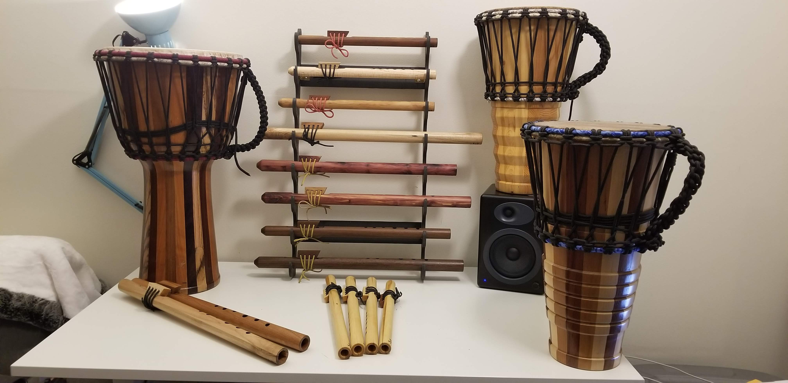

# Woodworking Projects

> *Personal woodworking — segmented turning, tables, instruments, and assorted craft pieces built outside of professional engineering work. The portfolio of an engineer who spends evenings and weekends in the shop.*

*(placeholder)*

## What this is

A catch-all repository for personal woodworking projects that don't have their own dedicated home. For projects that grew big enough to deserve their own repo, see:

- [`ashiko-drum-workshop`](https://github.com/tonykoop/ashiko-drum-workshop) — 2015 makerspace workshop, 16 stave-built ashiko drums
- [`djembe`](https://github.com/tonykoop/djembe) — stave-built djembes (Morgan Drums methodology)
- [`dundun`](https://github.com/tonykoop/dundun) — West African ensemble bass drums
- [`didgeridoo`](https://github.com/tonykoop/didgeridoo) — stave-built didgeridoo design
- [`flutes`](https://github.com/tonykoop/flutes) — Native American style wooden flutes
- [`fujara`](https://github.com/tonykoop/fujara) — Slovak overtone shepherd's flute
- [`chessboard-table`](https://github.com/tonykoop/chessboard-table) — segmented chessboard coffee table

This repository covers everything else.

## Projects

> *(Forthcoming — one section per project.)*

- **Segmented woodturning** — vessels, vases, and goblet-style turnings using contrast woods in glued-up segmented blanks
- **Wooden briefcase — segmented end-grain top** *(below)*
- *(other projects to be added)*

### Wooden briefcase — segmented end-grain top

*A wooden briefcase whose lid is built up using a segmented end-grain panel — the same construction technique used for premium end-grain cutting boards, scaled and oriented as a brick-bond pattern. Each end-grain block reveals the tree's growth rings as a target on the surface, and the brick offset gives the panel both visual rhythm and dimensional stability across glue lines.*

## Tools

The shop work documented here was done across several home and community shops over the years. Equipment used includes:
- Bosch 4100 portable contractor table saw
- Wood lathe (community shop)
- Bandsaw, router table, drill press, sanders

## License

Released under [CC-BY 4.0](LICENSE) — these are my own personal projects, free to reuse and adapt with credit.

## Status

| Section | Status |
|---|---|
| Repo description, license, gitignore | ✓ done |
| Project writeups | forthcoming |
| Hero photo | forthcoming |
